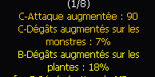

# Sur quelle upgrade de rune progressent les dégâts plantes et l'attaque augmentée ?

**Q:** Pour augmenter les dégâts sur les plantes et l'attaque augmentée d'une rune, faut-il viser une upgrade précise (+1/2, +3/4, etc.) ?

**A:** Ces bonus (attaque augmentée, dégâts sur les monstres, dégâts sur les plantes) progressent à chaque palier d'upgrade de la rune, et non uniquement à des paliers spécifiques : chaque niveau d'amélioration augmente ces trois statistiques.

