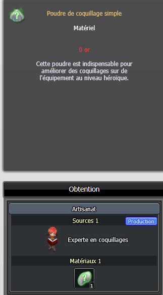

# Comment obtenir la poudre de coquillage simple

**Q:** Où obtient-on l'objet 'Poudre de coquillage simple' (matériau indispensable pour améliorer les coquillages sur l'équipement héroïque), et comment obtenir son matériau, un coquillage de niveau 1 à 3 ?

**A:** La poudre de coquillage simple se fabrique auprès de l'Experte en coquillages, en utilisant un coquillage de niveau 1 à 3 comme matériau. Ce coquillage s'obtient en détruisant une rune de rareté 1 à 3 auprès de cette même Experte en coquillages.

