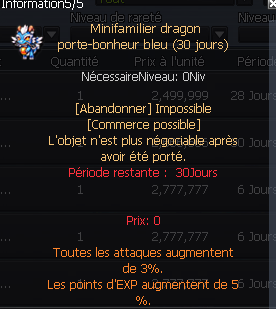

# Différence entre bonus d'XP normal et bonus d'XP héroïque

**Q:** Un bonus de +5% "points d'EXP" affiché sur un mini-familier (ex. dragon porte-bonheur bleu) donne-t-il aussi +5% d'XP héroïque ?

**A:** Non, il faut distinguer les deux libellés : un bonus explicitement nommé "+5% XP héroïque" donne bien +5% d'XP héroïque, tandis qu'un bonus générique "+5% de points d'EXP" (comme celui du mini-familier dragon porte-bonheur bleu, qui donne aussi +3% à toutes les attaques) ne s'applique pas à l'XP héroïque. En règle générale, pour estimer l'équivalent héroïque d'un bonus de points d'EXP normal, on divise approximativement ce pourcentage par deux.

