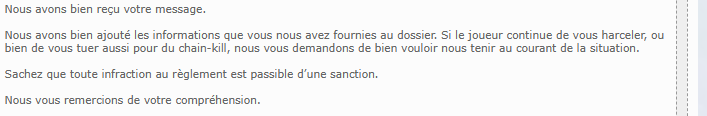

# Bloquer la place AFK ou la canne à pêche d'un joueur est-il sanctionnable ?

**Q:** Existe-t-il une règle interdisant de prendre la place afk d'un joueur ou de se mettre devant sa canne à pêche ? Est-ce considéré comme du harcèlement ?

**A:** D'après une réponse officielle du support Gameforge, tuer/chain-kill un joueur ou le harceler délibérément (par exemple en bloquant volontairement sa place ou sa canne à pêche) est considéré comme du harcèlement et est passible d'une sanction selon le règlement, même si les joueurs n'ont pas retrouvé la ligne exacte du règlement qui le mentionne explicitement. En cas de récidive, il est conseillé de signaler la situation via un ticket au support en fournissant des preuves.

