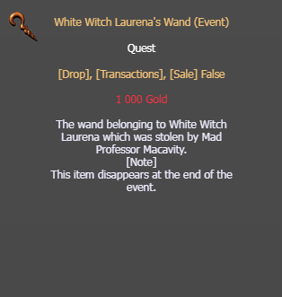

# Purpose of White Witch Laurena's Wand event item

**Q:** What is this item (White Witch Laurena's Wand) used for?

**A:** This is an event quest item — the wand belonging to White Witch Laurena, stolen by Mad Professor Macavity. It should be given to Laurena at Port Alveus. It cannot be dropped, traded, or sold, and it disappears at the end of the event.

