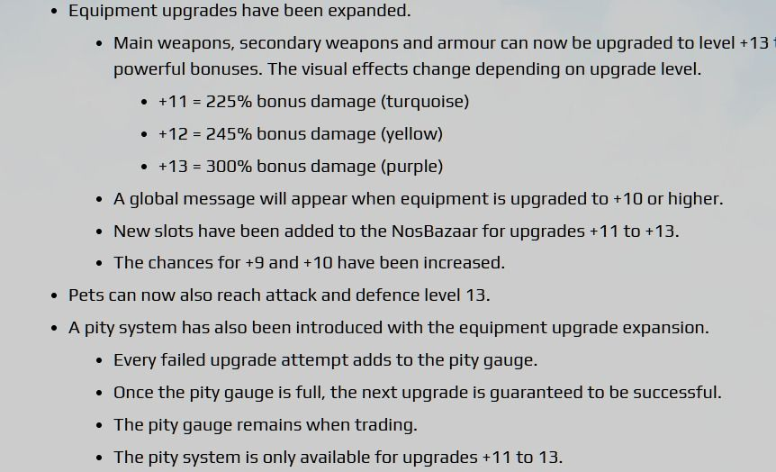

# Equipment and pet upgrades up to +13, and a bonus % discrepancy

**Q:** Can pets be upgraded to +11 or higher, and why does the patch note say +11 gives a 225% bonus while in-game it shows 220%?

**A:** According to the update notes, equipment upgrades were expanded so weapons and armor can reach +13, with bonus damage of 225% at +11, 245% at +12, and 300% at +13 (each level having a distinct visual effect color), and a pity system was added that guarantees success after enough failed attempts (applicable only to +11-+13, and it persists through trading). Pets were also included in this expansion and can now reach attack/defense level 13. One player pointed out a discrepancy where the announced +11 bonus (225%) doesn't match what is actually shown in-game (220%), which remains unresolved/unclear.

