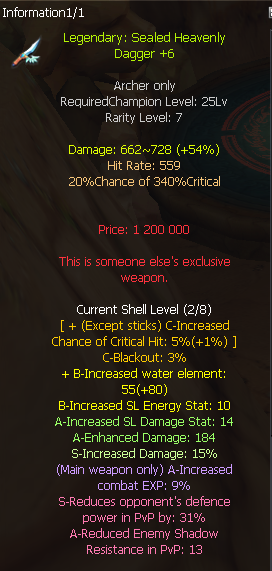

# Sealed Heavenly Dagger: +6 shelled vs clean +0 — which to buy?

**Q:** Choosing between two Legendary Sealed Heavenly Daggers (archer, required champion level 25, rarity 7), both priced around 100kk: one already upgraded to +6 with 2/8 shell slots filled via perfumes (~70kk + ~30kk perfumes), and one clean/unenhanced one (~100kk). Which is the better buy?

**A:** Go for the clean (unenhanced) dagger instead of the already-shelled +6 one. Wait for a shell event to cheaply fill 4/8 shell slots, then upgrade the weapon to +7 yourself.

