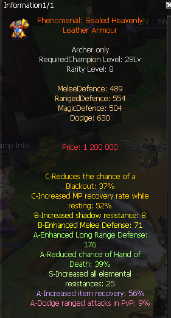

# Is elemental-resistance leather armour enough for Act7 farming?

**Q:** I found a Phenomenal Sealed Heavenly Leather Armour (rarity 8, archer, required champion level 28) for 30kk that gives +25 to all elemental resistances plus other defensive stats. Isn't that good enough to keep me safe against Act7 mobs?

**A:** Elemental resistance alone isn't the priority; instead look for gear with an S-tier 'overall defence' stat, and stack other defense types on top of that if possible.

