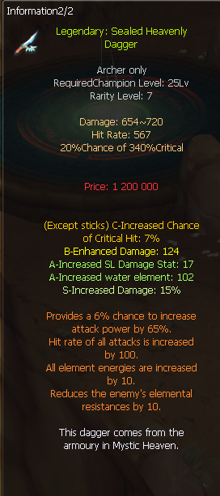
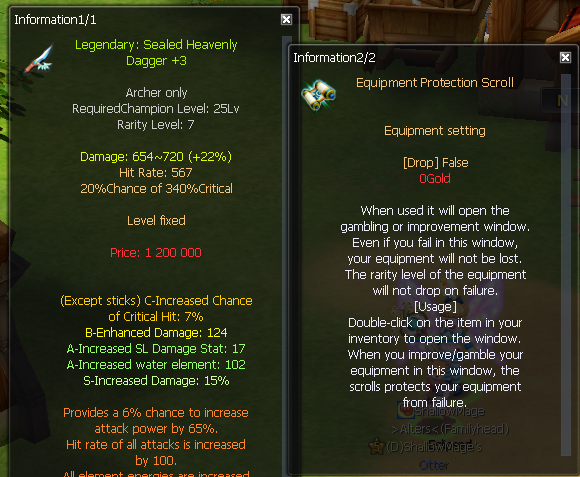
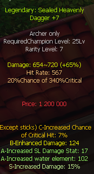

# Contexte

quite shallow (qss.) hésite entre deux Sealed Heavenly Dagger pour son archer Chasseur de démons (Demon Hunter) : une version « clean » (sans amélioration de coquillage) et une déjà montée « +6 », toutes deux autour de 100kk. Il compte acheter un arc assorti ensuite. Répondants : **Xoirea**, **KYO**, **Kyur**, **godlikeforce** (en retard sur le fil), **Flawless**, **Piotress**. Ensuite qss. améliore son arme, panique en croyant avoir tout cassé avec un parchemin, et demande jusqu'où monter. Terme important : le stuff est du **c25** (héroïque 25), donc du bas de gamme qu'il changera vite.

## Échange (EN → FR)

**quite shallow (18:23)** *(deux screenshots de dagues en comparaison)*
EN: Which one is better? I'll be buying a bow to match the dagger.
FR: Laquelle est la meilleure ? J'achèterai un arc assorti à la dague.

**KYO (18:24)**
EN: Depends on your SLs right now.
FR: Ça dépend de tes SL actuels.

**Xoirea (18:24)**
EN: Imho the clean one, since you can upgrade the shell more easily and taking it to +6/+7 is cheap work. Energy SL is irrelevant at this stage.
FR: À mon avis la clean, parce que tu peux améliorer le coquillage plus facilement et la monter à +6/+7 c'est pas cher. Le SL Énergie est sans importance à ce stade.

**KYO (18:25)**
EN: Take the clean one, bigger SL, attack 17, you can roll crit chance and enhancement almost for free.
FR: Prends la clean, plus gros SL, attaque 17, tu peux faire chance de crit et amélioration presque gratuitement.

**Xoirea (18:26)**
EN: The second one is 9% crit chance with shells, 204 enhanced damage once the shell is upgraded. Higher chance to roll SL damage if you want to push the shell to 6/8, but I'd stay at 4/8. Plus you don't need perfumes and you can just push the weapon to +6/+7 easily or higher with that money.
FR: La deuxième fait 9% de chance de crit avec les coquillages, 204 de dégâts améliorés une fois le coquillage monté. Plus de chances de faire du SL dégâts si tu veux pousser le coquillage à 6/8, mais je resterais à 4/8. En plus t'as pas besoin de parfums et tu peux juste pousser l'arme à +6/+7 facile ou plus avec cet argent.

**KYO (18:26)**
EN: +6 would be a troll on c25 gear.
FR: +6 ce serait du troll sur du stuff c25.

**quite shallow (18:27)**
EN: Yeah but as I said, the clean one is 100kk and the +6 is 70kk plus around 30kk in perfumes, so they're about the same price.
FR: Ouais mais comme j'ai dit, la clean est à 100kk et la +6 à 70kk plus environ 30kk de parfums, donc elles sont à peu près au même prix.

**Xoirea (18:27)**
EN: Either way, the second one. Wait for a shell event for a cheap 4/8 shell and just take it to +7.
FR: Dans tous les cas, la deuxième. Attends un event coquillage pour un coquillage 4/8 pas cher et monte-la juste à +7.

**KYO (18:27)**
EN: Both are top tier for exp and PvE. If they're close in price take the clean one, otherwise go for the +6.
FR: Les deux sont top tier pour l'exp et le PvE. Si elles sont proches en prix prends la clean, sinon prends la +6.

**Kyur (18:28)**
EN: The second one, 100%. 9% crit, 204 damage with a 4/8 shell which is quite simple to get, especially since that's the only C and B options you've got there.
FR: La deuxième, à 100%. 9% crit, 204 dégâts avec un coquillage 4/8 qui est assez simple à obtenir, surtout que c'est les seules options C et B que t'as là.

**quite shallow (18:29)**
EN: So 100kk isn't too bad a price for it?
FR: Donc 100kk c'est pas un trop mauvais prix pour ?

**KYO (18:29)**
EN: I don't know the price of other daggers on your server, but it's top tier, I'd pay 100.
FR: Je connais pas le prix des autres dagues sur ton serveur, mais elle est top tier, je mettrais 100.

**quite shallow (18:39)** *(screenshot dague +3, tooltip du parchemin)*
EN: I think I made a big mistake somehow, it fixed my weapon even though I used the scroll.
FR: Je crois que j'ai fait une grosse erreur, ça a réparé mon arme alors que j'ai utilisé le parchemin.

**Piotress (18:40)**
EN: It's fine, the scroll protects from failure, it doesn't fix your equipment.
FR: C'est bon, le parchemin protège de l'échec, il ne répare pas ton équipement.

**Flawless (18:40)** *(à « so what now »)*
EN: Amulet of Reinforcement. You wear the amulet and keep upgrading.
FR: Amulette de renforcement. Tu portes l'amulette et tu continues d'améliorer.

**quite shallow (18:41)**
EN: But it says it can destroy my weapon now.
FR: Mais ça dit que ça peut détruire mon arme maintenant.

**Kyur (18:41)**
EN: Equip the amulet, then use the scroll.
FR: Équipe l'amulette, puis utilise le parchemin.

**quite shallow (18:48)** *(screenshot dague +7)*
EN: I was so scared for a second that I did something wrong. +7 is the stopping point, right?
FR: J'ai eu tellement peur d'avoir fait une bêtise. +7 c'est le palier d'arrêt, non ?

**Kyur (18:49)**
EN: It's good enough. You can try +8, but without an event it can eat quite a lot of gold if you're unlucky. Probably better to spend that gold on c65 gear later on.
FR: C'est suffisant. Tu peux tenter +8, mais sans event ça peut bouffer pas mal d'or si t'as pas de chance. Mieux vaut sans doute garder cet or pour du stuff c65 plus tard.

**quite shallow (18:50)**
EN: Yeah makes sense, no point overinvesting in something I'll upgrade soon.
FR: Ouais logique, pas la peine de surinvestir dans un truc que je vais remplacer bientôt.

**godlikeforce (20:19)** *(arrive en retard sur la comparaison de dagues)*
EN: The right one. It just has better values than the other, it's not linked, and the only thing it's missing compared to the other is the blackout, which isn't really a necessity (it helps though). Sure the enhancement is lower, but the right one's enhancement is B, so easy shell upgrade, compared to the other being A, and I wouldn't invest a shell upgrade to A for a c25.
FR: Celle de droite. Elle a juste de meilleures valeurs que l'autre, elle n'est pas liée, et la seule chose qui lui manque par rapport à l'autre c'est le blackout, qui n'est pas vraiment une nécessité (ça aide quand même). L'amélioration est plus basse, mais l'amélioration de celle de droite est en B, donc coquillage facile à monter, contre l'autre qui est en A, et je n'investirais pas une amélioration de coquillage jusqu'en A pour du c25.

**quite shallow (20:20)**
EN: Got it to +8 already.
FR: Je l'ai déjà montée à +8.

## Mécaniques à retenir (EN → FR)

EN: A "clean" weapon (no shell upgrade) is often preferable to a pre-upgraded one when both cost about the same: you can upgrade the shell yourself and push the refinement to +6/+7 cheaply, and you avoid paying for perfumes.
FR: Une arme « clean » (sans amélioration de coquillage) est souvent préférable à une déjà montée quand les deux coûtent à peu près pareil : tu peux améliorer le coquillage toi-même et pousser le renfo à +6/+7 pas cher, et tu évites de payer les parfums.

EN: On c25 gear, pushing refinement to +6 is overkill ("troll"), and upgrading a shell all the way to A rank is a waste: a B-rank shell is enough and far easier to upgrade.
FR: Sur du stuff c25, pousser le renfo à +6 est excessif (« troll »), et monter un coquillage jusqu'au rang A est du gaspillage : un coquillage rang B suffit et se monte bien plus facilement.

EN: The Equipment Protection Scroll protects the item from breaking on a failed upgrade, it does not repair or "fix" the item.
FR: Le parchemin de protection d'équipement (Equipment Protection Scroll) protège l'objet de la casse en cas d'échec d'amélioration, il ne répare pas l'objet.

EN: To upgrade a weapon safely past the risky tiers, equip the Amulet of Reinforcement first, then use the protection scroll.
FR: Pour améliorer une arme sans risque au-delà des paliers dangereux, équipe d'abord l'amulette de renforcement (Amulet of Reinforcement), puis utilise le parchemin de protection.

EN: +7 is a good stopping point for a low-tier (c25) weapon. Going to +8 without an event can burn a lot of gold; better to save it for c65 gear.
FR: +7 est un bon palier d'arrêt pour une arme bas de gamme (c25). Monter à +8 hors event peut brûler beaucoup d'or ; mieux vaut le garder pour du stuff c65.

## Points à clarifier avant d'en faire une QA

- **Deux images de dagues, une seule sauvée** : le message de comparaison (18:23) portait deux screenshots, mais le scrap a écrasé l'un par l'autre (même nom de fichier). Seule la dague « clean » est disponible (`q094-sealed-heavenly-dagger-clean.png`). Impossible de vérifier laquelle chaque conseiller désigne (« la clean », « la deuxième », « celle de droite » de godlikeforce). Ne pas trancher sans le 2e screen.
- **« +6 troll pour du c25 » vs « got it to +8 already »** : qss. finit par pousser au-delà du +7 recommandé (jusqu'à +8). À signaler comme un choix du joueur, pas comme la reco du fil (la reco est +7).
- **« blackout »** cité par godlikeforce comme effet de coquillage manquant sur une des dagues : terme de coquillage à rapprocher de la terminologie nostar.fr avant de le citer.
- **« energy SL »** (Xoirea) : SL d'élément Énergie, jugé « sans importance à ce stade ». Pas de valeur chiffrée.

## Conversation originale

quite shallow - 18:23
which one is better

KYO - 18:24
depend ur sls atm

Xoirea - 18:24
Imho the clean one since You can easier upgrade the shell and +6/7 is cheap work
Energy SL is irrelevant at this stage

quite shallow - 18:24
ill be buying bow to fit the dagger

quite shallow - 18:25
theyre both at 100kk (including perfumes for +6 one)

KYO - 18:25
take the clean one bigger sl atk 17  u can make crit chance and ench for free almost

Xoirea - 18:26
Second one is crit chance 9% with shells
204 enhanced dmg with shell upgrade
Higher chance to up SL damage if You wanna try to push shell to 6/8 (I'd stay at 4/8)

KYO - 18:26 (reply Xoirea)
+6 would be troll for c25 eq

Xoirea - 18:26
Plus You don't need perfumes and You can just up the weapon for that money to +6/7 easy or higher

Xoirea - 18:27 (reply KYO)
I mean I see people on UC who have +10 gear on adventurers but yeah practically speaking 4/8 is max

quite shallow - 18:27
ye but as i said, the clean one is 100kk and the +6 is 70kk + around 30kk in perfumes so theyre around same price

KYO - 18:27 (reply Xoirea)
thats something else

Xoirea - 18:27 (reply qss.)
Either way second one, wait for shell event for cheap 4/8 shell and just +7 it

KYO - 18:27
but imo both are top tier for exp and pve if they are close in price take clean if not go for the +6

Kyur - 18:28 (reply qss.)
2nd one 100%

Kyur - 18:29
9% crit 204 dmg with 4/8 which is quite simple to get

Kyur - 18:29
especially because thats the only C and B options you got there

quite shallow - 18:29
so 100kk isnt too bad price for it?

KYO - 18:29
idk price of other dagger on ur serv but its top tier i would put 100

quite shallow - 18:30
aight buying it

quite shallow - 18:39
i think i made a big mistake somehow it fixed my weapon even though i used the scroll

Piotress - 18:40 (reply qss.)
it's fine, scroll protects from failure, not fixing your eq

quite shallow - 18:40
soo, what now

Flawless - 18:40 (reply qss.)
Amulet of Reinforcement

quite shallow - 18:41
but it says it can destroy my weapon now

Flawless - 18:41 (reply qss.)
you wear the amulet and keep upgrading

Kyur - 18:41
equip amulet -> use scroll

quite shallow - 18:42
ahh

quite shallow - 18:48
jesus i was so scared for a second i did something wrong +7 is the stopping point ye?

Kyur - 18:49
its good enough, you can try +8 but without event it can eat quite a lot of gold if unlucky

Kyur - 18:50
probably better to spend that gold on c65 gear later on

quite shallow - 18:50
ye makes sense, no point to overinvest in something ill upgrade soon

godlikeforce - 20:19 (reply qss. « which one is better »)
right one
Ik I'm late but still
it just has better values than the other
not linked
and the only thing it's missing than the other is the blackout which, not really a necessity (though it helps but yeah)
sure the enh is lower but
right one's enh is B
easy shell upgrade.
compared to the other one being in A and I wouldn't invest shell upgrade to A for a c25

quite shallow - 20:20 (reply godlikeforce)
got it +8 already