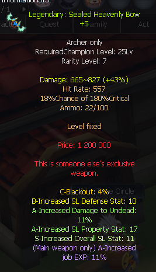
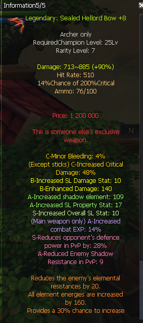

# Contexte

Toujours quite shallow (qss.), qui joue Chasseur de démons (Demon Hunter, SP7A) et cherche un arc assorti à sa dague. Il demande quelles stats viser. Répondant principal : **Kyur** (qss. vise trop haut pour son niveau). Un joueur tiers, **tonino1999**, glisse en parallèle une question sur les costumes d'arme PvE (voir la fiche divers q100). L'arc est une arme secondaire ici : le DH alterne SP dague et SP arc, d'où l'achat des deux (cf. q094).

## Échange (EN → FR)

**quite shallow (18:51)**
EN: And for the bow, since I'm going to play DH it can't really be bad. So SL overall 11, property 15+, anything else I should look at?
FR: Et pour l'arc, comme je vais jouer DH il peut pas vraiment être mauvais. Donc SL overall 11, property 15+, autre chose à regarder ?

**quite shallow (18:52)** *(screenshot d'un arc)*
EN: Something like this? Or ideally with crit / enhanced damage as well.
FR: Un truc comme ça ? Ou idéalement avec crit / dégâts améliorés aussi.

**Kyur (19:12)**
EN: This is good enough, but maybe find one with increased combat exp so you gain exp faster.
FR: Ça suffit, mais essaie peut-être d'en trouver un avec de l'exp de combat augmentée pour gagner de l'exp plus vite.

**quite shallow (19:16)** *(screenshot d'un arc très cher)*
EN: There's this one but it's hella expensive.
FR: Y'a celui-là mais il est hyper cher.

**quite shallow (19:18)**
EN: Yeah, nothing interesting besides this one, but I'm not dropping 200kk on that.
FR: Ouais, rien d'intéressant à part celui-là, mais je vais pas lâcher 200kk là-dessus.

**Kyur (19:19)**
EN: You don't need 11 overall and 17 property at this level.
FR: T'as pas besoin de 11 overall et 17 property à ce niveau.

**quite shallow (19:19)**
EN: Lmao, I upgraded it once at +8 since I had 3 leftover scrolls and it went first try.
FR: Mdr, je l'ai monté à +8 d'un coup vu que j'avais 3 parchemins en rab et c'est passé du premier coup.

**quite shallow (19:23)**
EN: I'm not looking at +11 / +17 specifically, there's just nothing worthwhile with all 3 of those stats together.
FR: Je vise pas +11 / +17 spécifiquement, c'est juste qu'il y a rien d'intéressant avec les 3 stats réunies.

## Mécaniques à retenir (EN → FR)

EN: On a secondary bow for a Demon Hunter at low level, high SL overall (11) and high property (15-17) are not needed. A modest bow is enough to progress.
FR: Sur un arc secondaire de Chasseur de démons à bas niveau, un gros SL overall (11) et un gros property (15-17) sont inutiles. Un arc modeste suffit pour avancer.

EN: A useful bonus to prioritise on the bow is increased combat exp, to level faster.
FR: Un bonus utile à privilégier sur l'arc est l'exp de combat augmentée, pour monter plus vite.

EN: Ideally also look for crit / enhanced damage lines, but don't overpay (e.g. 200kk) for a maxed-stat bow you'll outgrow quickly.
FR: Idéalement viser aussi des lignes de crit / dégâts améliorés, mais ne pas surpayer (ex. 200kk) un arc aux stats maxées que tu remplaceras vite.

EN: With leftover protection scrolls, a +8 upgrade can land first try, but that's luck, not a reason to chase +8 on a throwaway weapon.
FR: Avec des parchemins de protection en rab, un +8 peut passer du premier coup, mais c'est de la chance, pas une raison de viser +8 sur une arme jetable.

## Points à clarifier avant d'en faire une QA

- **Quel arc exactement** : le screen 18:52 (`q095-sealed-heavenly-bow-p5.png`) est un Sealed Heavenly Bow ; le screen 19:16 (`q095-sealed-hellord-bow-p8.png`) est un Sealed Hellord Bow +8, l'arc « hella expensive » à ~200kk. Confirmer que qss. achète bien un Sealed Heavenly Bow (le moins cher), pas le Hellord.
- **Cibles de SL** : qss. parle de « SL overall 11 » et « property 15+/17 ». Kyur dit que c'est trop pour son niveau. Pas de cible chiffrée « officielle » donnée : ne pas reprendre 11/17 comme reco.
- **« combat exp »** : bonus d'exp de combat sur l'arme ; vérifier le libellé exact nostar.fr avant citation.

## Conversation originale

quite shallow - 18:51
and as for bow since im gonna play dh it cannot be bad per say so sl overall 11, prop 15+ and anything else i should look at?

quite shallow - 18:52
something like this?

quite shallow - 18:52
or ideally with crit/enhanced dmg aswell

Kyur - 19:12
this is good enough but maybe find one with increased combat exp so you gain exp faster

quite shallow - 19:13
aight

quite shallow - 19:16
theres this but its hella expensive

quite shallow - 19:18
ye nothing interesting besides this one but i aint dropping 200kk on that

Kyur - 19:19
you dont need 11 overall and 17 property at this lvl xd

quite shallow - 19:19
lmao i upgraded it once at +8 since i had 3 leftover scrolls and it went 1st try

quite shallow - 19:23 (reply Kyur)
im not looking at +11 +17 specifically, theres just nothing worthwile with all 3 of those