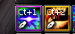
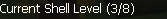
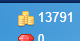

# Contexte

quite shallow (qss.) enchaîne deux systèmes annexes : les tatouages, puis le runique (« runes »). Clé de lecture : dans ce serveur EN, « shell » = coquillage (cf. q096) et « rune » = le système runique de l'arme (stats permanentes), mais dans d'autres langues les deux mots se croisent, d'où une clarification de vocabulaire de godlikeforce. Répondants : **Kyur**, **KYO**, **godlikeforce**. Message d'ensemble : le tatouage vaut le coup tôt (buff, +4/+5 accessible), le runique est un truc endgame à ne pas toucher sur du stuff c25.

## Échange (EN → FR)

**quite shallow (23:05)**
EN: What about tattoos, is it something only for endgame, or can I get some that help me early?
FR: Et les tatouages, c'est que pour l'endgame, ou je peux en avoir qui m'aident tôt ?

**Kyur (23:06)**
EN: You can get around +5-6 / +5-6. The correct ones are Attack Stance + Piercing Gaze.
FR: Tu peux monter dans les +5-6 / +5-6. Les bons, c'est Attack Stance + Piercing Gaze.

**KYO (23:06)**
EN: You should do it early if you can, it's a big power-up and +5 is basically free.
FR: Tu devrais le faire tôt si tu peux, c'est un gros gain de puissance et le +5 est quasi gratuit.

**godlikeforce (23:07)**
EN: You can take it to +4 with ease. +5 might take some attempts because a 20% chance likes to be funny sometimes, but +5 is the basic recommendation. No shame in staying at +4 if the game makes you unlucky.
FR: Tu peux le monter à +4 facilement. +5 peut demander quelques essais parce qu'un 20% aime bien faire des siennes, mais +5 est la reco de base. Aucune honte à rester à +4 si le jeu te rend malchanceux.

**quite shallow (23:09)**
EN: And what exactly is a tattoo, a passive that's always on, or a usable buff?
FR: Et c'est quoi exactement un tatouage, un passif toujours actif, ou un buff activable ?

**KYO / godlikeforce (23:09)**
EN: It's sort of a skill, a buff you activate when you want: 2 minutes of effect with a 4-minute cooldown. You slot it on your skill bar like any other skill. All tattoos have a 4-minute cooldown; the meta ones have a 2-minute duration.
FR: C'est une sorte de skill, un buff que tu actives quand tu veux : 2 minutes d'effet avec 4 minutes de cooldown. Tu le mets sur ta barre de skills comme n'importe quel skill. Tous les tatouages ont 4 minutes de cooldown ; les meta ont 2 minutes de durée.

**KYO (23:10)**
EN: If you die you lose it.
FR: Si tu meurs tu le perds.

**KYO (23:15)**
EN: Tattoos will probably be expensive if you don't get one quickly. You can craft it, but there are a lot of effects on each tattoo scroll.
FR: Les tatouages seront sans doute chers si tu n'en prends pas un rapidement. Tu peux le crafter, mais il y a beaucoup d'effets sur chaque parchemin de tatouage.

**quite shallow (23:11)**
EN: Alright, and what about runes?
FR: Ok, et les runes ?

**KYO (23:11)**
EN: For the weapon? Which one, the blue or the basic?
FR: Pour l'arme ? Laquelle, la bleue ou la basique ?

**godlikeforce (23:12)**
EN: Yes, the blue ones. He knows the other one as "shells", so there shouldn't be confusion like in some languages.
FR: Oui, les bleues. Lui connaît l'autre sous le nom de « shells » (coquillages), donc il ne devrait pas y avoir de confusion comme dans certaines langues.

**KYO (23:12)** *(screenshot fenêtre runique)*
EN: The rune they were talking about is this. You upgrade it at the NPC with a book at Nosville. It enhances the current rune on your weapon in exchange for materials like shell power or a stabiliser.
FR: La rune dont ils parlaient c'est ça. Tu l'améliores au PNJ avec un livre à Nosville. Ça renforce la rune actuelle de ton arme en échange de matériaux comme de la poudre de coquillage ou un stabilisateur.

**Kyur (23:12)**
EN: Runes are something you skip. You don't need runes bro, you need levels.
FR: Le runique c'est un truc que tu skip. T'as pas besoin de runes mec, t'as besoin de niveaux.

**quite shallow (23:13)**
EN: Yeah of course, but if there are free power-ups I'm not aware of, why wouldn't I capitalise on them?
FR: Ouais bien sûr, mais s'il y a des gains gratuits dont je suis pas au courant, pourquoi je m'en priverais ?

**godlikeforce (23:13)**
EN: Runes are something you might focus on later. It's essentially a system that provides permanent stats. Only main weapons can have runes upgraded onto them, but it works for both weapons.
FR: Le runique c'est un truc que tu peux viser plus tard. C'est en gros un système qui donne des stats permanentes. Seules les armes principales peuvent recevoir des améliorations runiques, mais ça marche pour les deux armes.

**Kyur / godlikeforce (23:13)**
EN: It's far from a "free power-up", it's super expensive.
FR: C'est loin d'être un « gain gratuit », c'est hyper cher.

**KYO (23:14)**
EN: 1 to 4 is free with some luck.
FR: 1 à 4 c'est gratuit avec un peu de chance.

**godlikeforce (23:15)**
EN: The thing with runes is that it has multiple kinds of stats. If you upgrade for the sake of upgrading, you'll get a lot of random stats, which is fine and easy to upgrade to at least 7/21. But if you want real stats, it takes a lot of upgrading and resetting.
FR: Le truc avec le runique c'est qu'il y a plusieurs types de stats. Si tu améliores juste pour améliorer, tu vas avoir plein de stats au hasard, ce qui est correct et facile à monter jusqu'à au moins 7/21. Mais si tu veux de vraies stats, ça demande beaucoup d'amélioration et de reset.

**KYO (23:16) / godlikeforce (23:16)**
EN: As you all said, he shouldn't do this for now or even think about it with c25 gear. It's usually much cheaper to just buy a weapon already runed with 13% attack, and at c80/c90 they're way cheaper.
FR: Comme vous dites tous, il ne devrait pas faire ça pour l'instant ni même y penser avec du stuff c25. C'est en général bien moins cher d'acheter une arme déjà runée avec 13% attaque, et au c80/c90 elles sont bien moins chères.

## Mécaniques à retenir (EN → FR)

EN: A tattoo is an activatable buff (a skill slotted on the bar), not a passive: 2 min duration for the meta ones, 4 min cooldown for all. You lose the buff on death.
FR: Un tatouage est un buff activable (un skill placé sur la barre), pas un passif : 2 min de durée pour les meta, 4 min de cooldown pour tous. Le buff est perdu à la mort.

EN: Take a tattoo early: +4 is easy, +5 is the basic recommendation (a 20% chance can make it take several tries), and staying at +4 is fine. The meta tattoos are Attack Stance and Piercing Gaze.
FR: Prendre un tatouage tôt : +4 facile, +5 est la reco de base (un 20% peut demander plusieurs essais), et rester à +4 est acceptable. Les tatouages meta sont Attack Stance et Piercing Gaze.

EN: Runes (the weapon "runic" system, the blue ones) give permanent stats. They can only be upgraded on a main weapon but apply to both weapons. Ranks 1-4 can be free-ish with luck, but real (targeted) stats need heavy upgrading + resetting and are very expensive.
FR: Le runique (les « bleues ») donne des stats permanentes. Il ne s'améliore que sur une arme principale mais s'applique aux deux armes. Les rangs 1-4 peuvent être quasi gratuits avec de la chance, mais de vraies stats (ciblées) demandent beaucoup d'amélioration + reset et coûtent très cher.

EN: On c25 gear, skip runes entirely. When it matters (c80/c90), it's usually far cheaper to buy a weapon already runed (e.g. 13% attack) than to rune one yourself.
FR: Sur du stuff c25, ignore totalement le runique. Quand ça comptera (c80/c90), c'est en général bien moins cher d'acheter une arme déjà runée (ex. 13% attaque) que d'en runer une soi-même.

EN: Terminology trap: on this English server "shell" = coquillage and "rune" = the runic weapon system. Some languages swap the two words, so confirm which system is meant.
FR: Piège de vocabulaire : sur ce serveur EN, « shell » = coquillage et « rune » = le système runique de l'arme. Certaines langues intervertissent les deux mots, donc confirmer de quel système on parle.

## Points à clarifier avant d'en faire une QA

- **Image `q097-rune-shell-level-3-8.png`** : la fenêtre affiche « Current Shell Level (3/8) ». Malgré le mot « Shell » à l'écran, le message de KYO la rattache au système runique de l'arme (upgrade au PNJ avec livre à Nosville). Ambiguïté d'affichage à lever avant citation (le client peut nommer « Shell » l'interface runique).
- **Chiffres « 7/21 », « 3/8 », « +5-6 »** : notations de niveaux (runique / coquillage / tatouage). Vérifier les libellés nostar.fr.
- **« 20% chance » pour le tatouage +5, « 1-4 gratuit » pour le runique** : approximations de joueurs, non officielles.
- **Tatouages meta Attack Stance + Piercing Gaze** : confirmés en DB (skills/buffs UK). Récupérer les noms FR officiels (patrons Loa) avant une réponse FR.
- **« craft it » / « tattoo scroll »** : les tatouages se craftent via des patrons Loa (Bear/Snake/Lion/Eagle Loa Tattoo Pattern en DB) ; préciser le process si QA.

## Conversation originale

quite shallow - 23:06
what about tattoos btw, is it something only for endgame or i can get some that will help me in early?

Kyur - 23:06
you can get like +5-6/+5-6

KYO - 23:06
u should do early if u can big power up and free +5

Kyur - 23:07
correct ones so Attack Stance + Piercing Gaze

godlikeforce - 23:07
you can up it to +4 with ease
+5 might take some attempts because 20% likes to be funny sometimes
but +5 is the basic recommendation
but no shame in staying in +4 if game decided to make you unlucky for +5

KYO - 23:09
first power up dont chgane alot so ye even +4 is good

quite shallow - 23:09
and whats tattoo, is it like a passive thats always on or its a usable buff or something like that?

godlikeforce - 23:09
it's a skill sort of

KYO - 23:09 (reply qss.)
its a buff u can activate when u want 2 min of effect with 4 min of cd u put on skill bar like ohter skill

quite shallow - 23:09
so basically like partner buff

godlikeforce - 23:09
you slot it to use it
they all have 4 minutes cooldown
the meta ones have 2 mins duration

KYO - 23:10 (reply qss.)
if u die u loose it

quite shallow - 23:10 (reply KYO)
well i mean the usable partner buff, like those 60 duration 80s cd

KYO - 23:10
ye kinda

quite shallow - 23:11
aight, and what about runes

KYO - 23:11
for weapon ? wich one the blue or basic

quite shallow - 23:11
yep

quite shallow - 23:11
i have no idea like could you explain the system to me

godlikeforce - 23:12
yes the blue ones, he knows the other one as shells

KYO - 23:12
the rune they were talking about are this u can upgrade them at the npc with book at nosvile its enhance the current rune u got on your weapon in exchange for material like shell power or stabilisator

Kyur - 23:12
runes is something you skip

godlikeforce - 23:12
ye Ik, that's why I said he knows it as shells
so there shouldn't be confusion liek some langauges do

Kyur - 23:13
you dont need runes bro you need levels 😂

quite shallow - 23:13 (reply Kyur)
ye ofcourse but if theres free power ups that im not aware of why wouldnt i capitalize on them

godlikeforce - 23:13
runes are something you might focus for later, but it's essentially a system taht provides perma stats

godlikeforce - 23:13
only main weps can have runes upgraded to it, but it works for both weapons

Kyur - 23:14
its far from a "free powerup"

godlikeforce - 23:14
yeah it's super expensive

KYO - 23:14
1-4 is free with some luck

Kyur - 23:14
shell upgrade is the only one you should take a look

quite shallow - 23:14
ah, good to know, cuz like 2 before were somewhat free as you said, the shell and tattoos i suppose

Kyur - 23:14
*somewhat*

quite shallow - 23:15
i mean its not like im broke

KYO - 23:15
tattoo will prolly be expensive if u dont get it fast u can craft it buf there are a lot of effect on each tattoo scrool

godlikeforce - 23:15
like the thing with runes is that it has multiple kinds of stats
if u upgrade for teh sake of upgrading, you'll get a lot of whatever stats
Which is fine, and easy to upgrade to at least 7/21

godlikeforce - 23:15
but, if you want real stats, it will take a lot of upgrading and resetting

KYO - 23:16 (reply godlikeforce)
as u yall said he shouldt do this for now or even think about it with c25 eq

quite shallow - 23:16
aight so purely late game thing, gotcha

godlikeforce - 23:16
yeah , it's usually much cheaper to just buy a wep already runed with 13% atk

KYO - 23:16
ye if he buy then c80/90 they are way cheaper