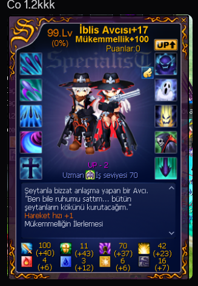

# Contexte

quite shallow (qss.) demande, après coquillages/tatouages/runique, comment fonctionnent les fées. Il a des fées classiques 80% (obscurité et lumière), pas des drones. Il a vu des modificateurs énormes sur les drones et veut savoir si c'est hors de prix. Répondants : **KYO**, **Kyur**, **godlikeforce**. En parallèle, qss. enchérit sur une carte SP Chasseur de démons (Demon Hunter, SP7A) qu'il compte monter, d'où les conseils +15/+100 / +20. Deux sujets liés : la fée (à laisser pour l'endgame) et la SP (à prioriser maintenant).

## Échange (EN → FR)

**quite shallow (23:18)**
EN: One more question about fairies. I've got 80% dark and light ones, not drones. I've seen you can get insane modifiers on drones, but it's probably hella expensive, right?
FR: Encore une question sur les fées. J'ai des 80% obscurité et lumière, pas des drones. J'ai vu qu'on peut avoir des modificateurs de fou sur les drones, mais c'est sans doute hors de prix, non ?

**KYO (23:20)**
EN: You can get a drone for not much at the start. It's clean, with 80% + 1 SL property and -3 res, so a bit of damage. But the runes are expensive to turn into a good one, it's a luck system like the others.
FR: Tu peux avoir un drone pour pas grand-chose au début. Il est clean, avec 80% + 1 SL property et -3 res, donc un peu de dégâts. Mais les runes coûtent cher pour en faire un bon, c'est un système de chance comme les autres.

**Kyur (23:20)**
EN: The only fairies you upgrade are drones and Fernons.
FR: Les seules fées que tu améliores sont les drones et les Fernons.

**godlikeforce (23:20)**
EN: Fairies are exactly like runes: a lot of upgrading and resetting until you get the stats you want, and then you gamble the percentages with converters. Yes, it has multiple layers of RNG. So, another endgame system.
FR: Les fées c'est exactement comme le runique : beaucoup d'amélioration et de reset jusqu'à avoir les stats voulues, puis tu gamble les pourcentages avec des convertisseurs. Oui, il y a plusieurs couches de RNG. Donc, encore un système endgame.

**KYO (23:21)**
EN: You can have up to 9 runes on it, but the ones that really matter are the last 3, and they're expensive. So maybe get a drone in act 9, exp it to 110% and upgrade it, or just buy a good one only for exp.
FR: Tu peux avoir jusqu'à 9 runes dessus, mais celles qui comptent vraiment sont les 3 dernières, et elles sont chères. Donc peut-être chope un drone en acte 9, monte-le à 110% et améliore-le, ou achète-en juste un bon uniquement pour l'exp.

**Kyur (23:23)**
EN: Get your DH to +20 before upgrading the fairy.
FR: Monte ta DH à +20 avant d'améliorer la fée.

**KYO (23:23)**
EN: But for now, up to c65, you're going to destroy the classic LoL.
FR: Mais pour l'instant, jusqu'au c65, tu vas démonter la LoL classique.

**quite shallow (23:23)** *(screenshot d'une carte SP DH +17 Perfection +100)*
EN: Yeah, I'm bidding on this right now. It's not 80 like I wanted, but if I get it somewhat cheap I won't mind.
FR: Ouais, j'enchéris sur celle-ci là. C'est pas 80 comme je voulais, mais si je l'ai plutôt pas cher ça me dérange pas.

**KYO (23:25)**
EN: If you don't buy one by then, try to get at least a +15/+100 but with high attack.
FR: Si tu n'en achètes pas une d'ici là, essaie d'en avoir au moins une +15/+100 mais avec grosse attaque.

**quite shallow (23:25)**
EN: I'm trying but there's none on NosBazar.
FR: J'essaie mais y'en a aucune sur le NosBazar.

**KYO (23:27)**
EN: For PvE this one would suit you for the whole game if you take it to +20 anyway.
FR: Pour le PvE celle-ci t'irait pour tout le jeu si tu la montes à +20 de toute façon.

**quite shallow (23:28)**
EN: Yeah that was the plan, to get something around 80 PvE +15 and then enhance it myself to +20.
FR: Ouais c'était le plan, choper un truc genre 80 PvE +15 et l'améliorer moi-même à +20.

## Mécaniques à retenir (EN → FR)

EN: Only drones and Fernons are upgradeable fairies. Classic fairies (e.g. 80% dark/light) are not upgraded.
FR: Seuls les drones et les Fernons sont des fées améliorables. Les fées classiques (ex. 80% obscurité/lumière) ne s'améliorent pas.

EN: A drone works like the rune system: upgrade + reset until you get the stats you want, then gamble the percentages with converters (multiple RNG layers). It's an endgame system.
FR: Un drone fonctionne comme le système runique : upgrade + reset jusqu'à obtenir les stats voulues, puis gamble des pourcentages avec des convertisseurs (plusieurs couches de RNG). C'est un système endgame.

EN: A drone can hold up to 9 runes, but only the last 3 really matter (and are expensive). A clean drone (80% + 1 SL property, -3 res) is cheap early; you can also just buy a good one for exp, or exp a drone to 110% in act 9 before upgrading.
FR: Un drone peut porter jusqu'à 9 runes, mais seules les 3 dernières comptent vraiment (et sont chères). Un drone clean (80% + 1 SL property, -3 res) est pas cher tôt ; tu peux aussi juste en acheter un bon pour l'exp, ou monter un drone à 110% en acte 9 avant de l'améliorer.

EN: Priority for a low-level DH archer: level the DH specialist (aim for +15/+100 with high attack, then push it to +20 yourself) before investing in the fairy. A +20 PvE SP carries you the whole game. Up to c65 you'll crush the classic LoL anyway.
FR: Priorité pour un archer DH bas niveau : monter la SP Chasseur de démons (viser +15/+100 avec grosse attaque, puis la pousser à +20 soi-même) avant d'investir dans la fée. Une SP PvE +20 te porte tout le jeu. Jusqu'au c65 tu démontes la LoL classique de toute façon.

## Points à clarifier avant d'en faire une QA

- **« up to 9 runes on it, last 3 matter »** (KYO) : s'applique au drone/fée. Confirmer le nombre exact d'emplacements et lesquels comptent avant citation (barème drone sur le forum, sujet 1459999506836881511).
- **« exp it till 110% »** : les fées/drones montent au-delà de 100% ? Vérifier le plafond d'xp de fée nostar.fr.
- **Carte SP** : l'image montre une carte Chasseur de démons +17 Perfection +100 (client turc). qss. voulait du « 80 » (probablement une SP montée via 80 pierres de perfectionnement ou un niveau de job 80 ?) : sens de « 80 » à préciser. Ne pas confondre avec le niveau du perso.
- **« +15/+100 »** = niveau d'amélioration SP +15 et perfectionnement +100. « +20 » = amélioration SP max. Vérifier la notation.
- **Fernons** : cités mais non détaillés ici (juste « drones et Fernons s'améliorent »). Fernon (Fire/Water/Light/Shadow) confirmés en DB ; renvoyer aux fiches/forum Fernon si QA.

## Conversation originale

quite shallow - 23:17
im lowkey sorry for spamming this much but i like to know things beforehand so i dont troll myself early and suffer cuz of it, i like doing research

KYO - 23:17
its good for me always good to help

quite shallow - 23:18
and 1 more question about fairies, got 80% dark and light ones - not drones, ive seen you can get some insane modifiers on drones but its probably hella expensive, right?

KYO - 23:20
u can get a drone for not so much at start its clean with 80% +1 sl property and -3 res so a bit of damage but the rune are expensive to make into good one its luck system like other

Kyur - 23:20
the only fairies you upgrade are drones and Fernons

godlikeforce - 23:20
fairies are exactly like runes, a lot of upgrade and reset til u get the stats u want
And then gamble %s with converters

godlikeforce - 23:20
yes it has multiple layers of rng

godlikeforce - 23:21
so, another endgame system

KYO - 23:21
u can have up to 9 rune on it but the one who really matter are last 3 one and expensive so maybe u can get a drone in act9 to exp it till 110% and upgrade it or buy a good one only for exp

quite shallow - 23:23
gotcha

Kyur - 23:23
get your DH to +20 before upgrading fairy

KYO - 23:23
But for now till c65 u gonna destroy the clol

quite shallow - 23:23
ye im bidding on this rn

KYO - 23:23
Nice one

quite shallow - 23:24
its not 80 as i wanted but if i get it somewhat cheap i wont mind

KYO - 23:25
If u dont buy one till then try to get a even +15 +100 but with high atk

quite shallow - 23:25
im trying but theres none on nosbazar

KYO - 23:27
For pve this would suit you for all the game if you put it +20 anyway

quite shallow - 23:28
ye that was the plan, to get something around 80pve +15 and then enhance it myself to +20