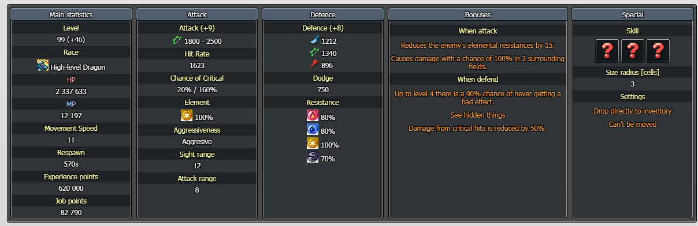

# Contexte

quite shallow (qss., archer DH) cherche une armure. Il a des Black Leather S6 (résistances ~100 partout) et hésite sur ce qu'il faut prioriser : défense plate, résistances, ou réduction de chance de crit. Débat central : qss. pense que l'anti-crit est inutile puisqu'il a déjà ~-100% de dégâts de crit subis, mais **KYO** et **Kyur** expliquent que réduire la *chance* de crit (« can't crit me ») vaut mieux que réduire les *dégâts* de crit, surtout en LoL et en endgame où les crits de mobs sont énormes. **godlikeforce** illustre avec le raid Nezarun. Répondants : **KYO**, **Kyur**, **godlikeforce**.

## Échange (EN → FR)

**quite shallow (23:44)** *(screenshot d'une armure)*
EN: This looks not too bad, no?
FR: Ça a pas l'air trop mal, non ?

**KYO (23:45)**
EN: This looks bad. Go for S defence, and other defence too if you can.
FR: Ça a l'air mauvais. Vise la défense S, et les autres défenses aussi si tu peux.

**KYO (23:51)** *(screenshot de 2 armures)*
EN: These are good and cheap.
FR: Celles-ci sont bonnes et pas chères.

**quite shallow (00:02)**
EN: But there's only 1 type of defence on them.
FR: Mais elles n'ont qu'un seul type de défense.

**KYO (00:04)**
EN: You don't really need more for early game. Even later, you're going overkill for the early.
FR: T'as pas vraiment besoin de plus pour le early game. Même plus tard, tu surdimensionnes pour le early.

**quite shallow (00:06)**
EN: So why isn't this one okay? It's only 30kk at r8 and will cap my res plenty, so a7 mobs won't shred me below 100 at all. I heard overall defence is only needed at a9 and later.
FR: Alors pourquoi celle-ci ne va pas ? Elle est à seulement 30kk en r8 et va cap mes res largement, donc les mobs de l'a7 ne me descendront pas sous 100. J'ai entendu que la défense globale n'est requise qu'à l'a9 et après.

**Kyur (00:13)**
EN: Imo try to get an armour with 10+ reduced chance of crit. Flat defence is nice to have but not 100% necessary. At that level I'd go for anti-effects or resistances if you don't want to spend on res yet. This will be enough to get you to c65, then you'll upgrade your armour.
FR: À mon avis essaie d'avoir une armure avec 10+ de réduction de chance de crit. La défense plate c'est agréable mais pas 100% nécessaire. À ce niveau je viserais anti-effet ou résistances si tu ne veux pas encore dépenser en res. Ça suffira pour aller au c65, après tu changeras d'armure.

**KYO (00:14)**
EN: Both of them have it even if lower, so I'd say the magic-def one to tank the deer, ngl.
FR: Les deux l'ont même si plus bas, donc je dirais celle avec def magique pour tank le cerf, franchement.

**quite shallow (00:15)**
EN: Yeah I'm on S6 black leathers so I'm around 100 on all, but then there's ele shred, so with armour I could ignore it.
FR: Ouais je suis en Black Leather S6 donc je suis autour de 100 partout, mais y'a le shred d'élément, donc avec l'armure je pourrais l'ignorer.

**Kyur (00:15)**
EN: Both of them only have 6%, too low.
FR: Les deux n'ont que 6%, trop bas.

**quite shallow (00:16)**
EN: Also isn't reduced-crit kind of pointless? I've got like -100% crit damage taken as someone recommended, so crits aren't an issue anymore. I get it'd be important at 60+, but for early it's probably okay to skip, no?
FR: Et puis la réduction de crit c'est pas un peu inutile ? J'ai genre -100% de dégâts de crit subis comme on me l'a conseillé, donc les crits ne sont plus un problème. Je comprends que ce serait important à 60+, mais pour le early on peut sans doute skip, non ?

**Kyur (00:17)**
EN: You'll enjoy the slap from dragons on LoL.
FR: Tu vas apprécier la baffe des dragons en LoL.

**KYO (00:17)**
EN: It's the probability of taking a crit, not the amount lowered.
FR: C'est la probabilité d'en prendre un, pas le montant réduit.

**Kyur (00:18)**
EN: Why get crit-damage-taken reduction when you can get a "can't crit me" status?
FR: Pourquoi prendre de la réduction de dégâts de crit subis quand tu peux avoir un statut « ne peut pas me crit » ?

**quite shallow (00:18)**
EN: Yeah but if I'm negating the majority of crit damage, then getting critted doesn't hurt that much. But does 6% really matter? Do we know how much crit chance mobs have?
FR: Ouais mais si je néga la majorité des dégâts de crit, alors me faire crit ne fait pas si mal. Mais est-ce que 6% compte vraiment ? Est-ce qu'on sait combien de chance de crit ont les mobs ?

**Kyur / KYO (00:19)**
EN: Yes, you can check in nosapki, or by right-clicking the mob. For example with this one he'll almost never crit, he has a 20% base.
FR: Oui, tu peux vérifier sur nosapki, ou en faisant clic droit sur le mob. Par exemple avec celui-ci il ne critera presque jamais, il a 20% de base.

**Kyur (00:20)**
EN: Anyway, I'd get 10% crit reduction, or like 8% (and then double-upgrade the shell to get it to 8+8, which could end up much more expensive), plus an anti-effect shell. The rest is whatever until c65.
FR: Bref, je prendrais 10% de réduction de crit, ou genre 8% (et ensuite tu double-améliore le coquillage pour l'amener à 8+8, ce qui peut finir bien plus cher), plus un coquillage anti-effet. Le reste peu importe jusqu'au c65.

**quite shallow (00:21)**
EN: So anti-effect is BiS S?
FR: Donc l'anti-effet c'est le BiS en S ?

**Kyur (00:21)**
EN: For LoL yes. Also mobs at this stage don't have crazy stats yet, so it's still good outside events too.
FR: Pour la LoL oui. Et les mobs à ce stade n'ont pas encore des stats de fou, donc c'est bon même hors event.

**godlikeforce (00:24)** *(screenshot crit du raid Nezarun)*
EN: Crits are really powerful on mobs, which is why an anti-crit shell is pretty solid. This is especially true in later stages where mobs have absurd crit damage, so you really want them to not land a crit in the first place. Take the Neza raid: 40% chance, 510% crit damage.
FR: Les crits sont très puissants sur les mobs, c'est pour ça qu'un coquillage anti-crit est solide. C'est surtout vrai dans les stades avancés où les mobs ont des dégâts de crit absurdes, donc tu veux vraiment qu'ils ne placent pas de crit du tout. Prends le raid Neza : 40% de chance, 510% de dégâts de crit.

**quite shallow (00:25)**
EN: Is 10% the max crit-chance reduction?
FR: 10% c'est le max de réduction de chance de crit ?

**godlikeforce / Kyur (00:25)**
EN: A lot of C-to-A armour shells are just useless, and anti-crit happens to be one of the very few that stay useful. Max is like 16%.
FR: Beaucoup de coquillages d'armure du rang C au A sont juste inutiles, et l'anti-crit est l'un des très rares qui restent utiles. Le max c'est genre 16%.

**godlikeforce (00:28)**
EN: Neza's voke attack hits me for 75% of my HP if it crits me, and I'm a mage (so I have mana shield for defence). Granted, AM doesn't have the greatest mana shield versus other mage SPs, but it's still a mana shield other classes don't have. If it doesn't crit, it only slaps me for like 15% HP. The difference between crit and no crit is insane.
FR: L'attaque de provocation de Neza me fait 75% de mes PV si elle crit, et je suis mage (donc j'ai le bouclier de mana en défense). C'est vrai que l'AM n'a pas le meilleur bouclier de mana comparé aux autres SP mage, mais c'est quand même un bouclier de mana que les autres classes n'ont pas. Si ça ne crit pas, ça me tape seulement 15% des PV. La différence entre crit et pas crit est énorme.

**KYO (00:29)**
EN: With full c99 gear the damage is reduced a lot though.
FR: Avec le stuff c99 complet les dégâts sont quand même bien réduits.

## Mécaniques à retenir (EN → FR)

EN: For an early archer armour, prioritise reduced chance of crit (aim 10%+, max around 16%) and an anti-effect shell over flat defence. Flat defence is nice but not necessary; overall defence only really matters at a9+.
FR: Pour une armure d'archer early, privilégier la réduction de chance de crit (viser 10%+, max autour de 16%) et un coquillage anti-effet plutôt que la défense plate. La défense plate est agréable mais pas nécessaire ; la défense globale ne compte vraiment qu'à partir de l'a9.

EN: Reducing crit CHANCE ("can't crit me") beats reducing crit DAMAGE taken: it's better to prevent the crit entirely than to soften it, because mob crit damage becomes absurd later (Neza raid: 40% crit chance, 510% crit damage).
FR: Réduire la CHANCE de crit (« ne peut pas me crit ») vaut mieux que réduire les DÉGÂTS de crit subis : mieux vaut empêcher le crit que l'amortir, car les dégâts de crit des mobs deviennent absurdes plus tard (raid Neza : 40% de chance, 510% de dégâts de crit).

EN: Anti-crit is one of the very few armour shells (ranks C to A) that stays useful; most others are useless. Anti-effect is BiS in the S slot for LoL, and still good outside events at this stage.
FR: L'anti-crit est l'un des très rares coquillages d'armure (rangs C à A) qui reste utile ; la plupart des autres sont inutiles. L'anti-effet est BiS dans l'emplacement S pour la LoL, et reste bon hors event à ce stade.

EN: You can read a mob's crit chance in-game via right-click, or on nosapki. A mob with a 20% base crit chance will almost never crit once you stack crit-chance reduction.
FR: On peut lire la chance de crit d'un mob en jeu via clic droit, ou sur nosapki. Un mob à 20% de chance de crit de base ne critera presque jamais une fois qu'on empile de la réduction de chance de crit.

EN: A cheap early armour with only one defence type is fine (KYO: don't overkill for early). This gear carries to c65; then you upgrade. A "magic-def" armour helps to tank certain mobs (e.g. the deer).
FR: Une armure early pas chère avec un seul type de défense suffit (KYO : ne surdimensionne pas pour le early). Ce stuff tient jusqu'au c65 ; ensuite on change. Une armure « def magique » aide à tank certains mobs (ex. le cerf).

## Points à clarifier avant d'en faire une QA

- **Valeurs de réduction de chance de crit** : Kyur dit « 10+ », « ou 8% puis double-upgrade à 8+8 », godlikeforce/Kyur situent le max « genre 16% ». Chiffres approximatifs de joueurs : confirmer le plafond exact (voir sujet forum 1301550711955263612 softcrit armures 90 vs anti-crit).
- **« anti effect shell » / « anti-crit shell »** : deux coquillages distincts (anti-effet en emplacement S, anti-crit = réduction de chance de crit). Vérifier les noms nostar.fr des coquillages d'armure avant citation.
- **« s6 black leathers »** : set Black Leather S6 (armure de résistances) ; « ele shred » = réduction d'élément infligée par les mobs. Préciser les termes officiels.
- **Neza / Nezarun** : « 40% chance, 510% cdmg » = valeurs de crit du boss du raid Nezarun lues à l'écran (`q099-neza-crit-40-510.png`). godlikeforce joue AM (SP11AM ?) d'où la mention du bouclier de mana : son « voke attack » = attaque de provocation du boss.
- **Image `q099-sealed-heavenly-leather-armour.png`** vs les deux armures de KYO (`...-x2.png`) : identifier laquelle est retenue (KYO penche pour la version def magique) avant une réponse.

## Conversation originale

quite shallow - 23:44
👀 this looks not too bad no?

KYO - 23:45
this look bad

KYO - 23:45 (reply qss.)
go for s defence and if u can other defence

KYO - 23:49
are u from uc ?

quite shallow - 23:49
ye

KYO - 23:51
these are good and cheap

quite shallow - 00:02 (reply KYO)
but theres only 1 type of defence

KYO - 00:04
u dont really need more for early game even later ur going overkill for the early

quite shallow - 00:06 (reply qss. « this looks not too bad »)
so why isnt this one okay, its only 30kk at r8 and will cap me plenty enough on res that a7 mobs wont shred me below 100 whatsoever

quite shallow - 00:06
heard that overall def is only required at a9 and later

KYO - 00:07
what resis u got now ?

Kyur - 00:13
imo try to get an armor with 10+ reduced chance of crit

Kyur - 00:13
flat defence are nice to have but not 100% necessary

Kyur - 00:14
and at that level I'd go for anti effects or resistances if you dont wanna spend on res yet

Kyur - 00:14
this will be enough to get to c65 then you will upgrade your armor

KYO - 00:14
both of them even if lower got it so i woud say the magic def one to tank deer ngl

quite shallow - 00:15
ye im on s6 black leathers so im around 100 on all but then theres ele shred so with armors i could ignore it

Kyur - 00:15
both of them only got 6%, too low

quite shallow - 00:16 (reply Kyur)
also isnt -crit kinda pointless? i got like -100% crit dmg taken as someone recommended and these arent an issue anymore

quite shallow - 00:17
i get itd be important at 60+ but for early prolly ok to skip it no?

Kyur - 00:17
you will enjoy the slap from dragons on LoL

KYO - 00:17 (reply qss.)
its the probability of taking one not the % lower

Kyur - 00:18
why get crit dmg taken reduction when you can get "cant crit me" status

quite shallow - 00:18 (reply KYO)
ye but like if im negating majority of crit dmg then getting critted doesnt hurt that much

quite shallow - 00:18 (reply Kyur)
but does 6% really matter? do we know how much crit chance mobs have?

KYO - 00:18
i dont know if u can lower much of the top

Kyur - 00:19 (reply qss.)
yes you can check in nosapki

KYO - 00:19
all this info u can get on right click on them or nosapki

KYO - 00:19
for example with this he will almost not deal any crit h has one 20% base

Kyur - 00:20
anyways I'd get 10% crit reduction or like 8% (and then you double upgrade shell to get it to 8+8, could end up much more expensive) and anti effect shell

Kyur - 00:21
rest is whatever until c65

quite shallow - 00:21
so anti effect is bis S?

Kyur - 00:21
for LoL yes

Kyur - 00:22
also mobs at this stage dont have crazy stats yet so its still good outside even

quite shallow - 00:23
gotcha

godlikeforce - 00:24
Crits are really powerful on mobs, hence why anti crit shell is pretty solid
This is especially true in later stages of the game where mobs just have... ABSURD crit damage so you really want them to just not land a crit to begin with
take for example Neza raid
40% chance , 510% cdmg

quite shallow - 00:25 (reply godlikeforce)
10% is max crit chance reduc?

godlikeforce - 00:25
it's also the fact that a lot of C-A armor shells are just useless, and anti-crit simply happens to be one of the very few that stay useful

Kyur - 00:25
max is like 16%

godlikeforce - 00:28
neza's voke attack hits me for 75% of my HP if it crits me and I'm a mage (thus I have mana shield for defence) 😭 granted AM doesn't have the greatest mana shield vs any other mage SP but it's still a mana shield that other classes don't have
if it doesn't crit it only slaps me for like 15% HP, the difference is insane between no crit vs crit

KYO - 00:29
with the c99 full eq the dmg are reduced alot tough